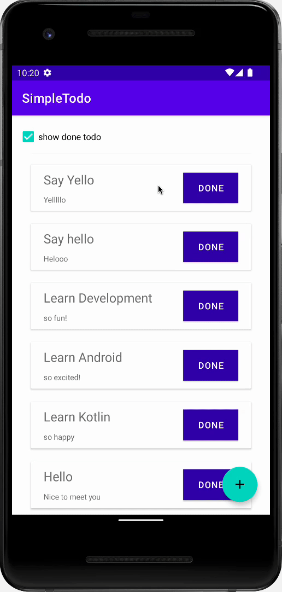

# Wafflestudio Android Seminar Assignment1

## 과제의 목표
- TODO 리스트 관리를 위한 앱 UI 를 Android Room Database, Android ViewModel, Kotlin Flow 등을 활용하여 제작한다.
- 과정에서 필요하다면 레포지토리에 포함된 스켈레톤 코드를 사용해도 된다.

## 과제 상세
- 할 일 목록을 관리하는 TODO 앱을 제작한다.
- 이 앱은 앱을 껐다 켜도 남아있는 영속성 있는 TODO 정보를 제공해야 한다
- 제작하는 과정에서 Android Room Database, Android ViewModel, Kotlin Flow, Jetpack Navigation 등을 사용하길 권장한다.

## 최소 스펙

### 리스트 페이지
1. 사용자는 내가 가진 TODO 들이 포함된 리스트를 볼 수 있다.
2. 리스트의 각 TODO 들은 `title`, `content` 를 보여주어야 한다.
3. 리스트의 각 TODO 들은 버튼을 가지며, 이 버튼을 토글하여 `DONE`, `UNDONE` 상태로 변경할 수 있어야 한다.
4. 사용자는 화면 상단에 위치한 체크박스를 통해 `UNDONE` 상태의 TODO만 볼 지, `DONE` 상태의 TODO도 보여줄 지 설정을 변경할 수 있다.
5. 화면 우측 하단에 클릭시 **TODO 추가 페이지** 로 진입하는 버턴이 있어야 한다.

### TODO 추가 페이지
1. 사용자는 `title`, `content` 를 입력할 수 있는 텍스트 필드 두개를 볼 수 있다.
2. 사용자는 TODO 를 추가할 수 있는 버튼을 볼 수 있다.
3. TODO 추가하기 버튼을 누를 시, title 과 content 의 내용을 가지고 `UNDONE` 상태의 새로운 TODO 를 만들어야 한다.
4. 이때, 만들기가 완료되었다면 적절한 토스트 메세지와 함꼐 **리스트 페이지** 로 돌아갈 수 있다.

## 앱 데모

  
## 과제 제출 방법
1. assignement 레포지토리를 fork 한다.
2. fork 한 소스코드를 clone 하여 `assignment-1/SimpleTodo` 파일 위에서 개발을 진행한다.
3. 개발 완료시 개발한 내용을 commit 하고 fork 한 레포지토리에 push 한다.
4. push 한 내용을 assignment 레포지토리에 pull reqest 로 날린다.
